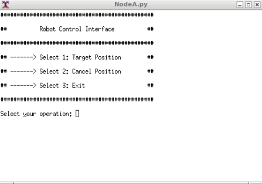

Research Track I - Second Assignment
================================
ROS Robot Simulator with Gazebo Simulation Environment - Delucchi Manuel (S4803977)
================================

Project Description
----------------------

It is the purpose of this assignment to develop a ROS package containing three ROS nodes that provide a way to interact with the environment presented in the `assignment_2_2022` package. 

The aim of the assignment is to create a package, in which the following nodes will be developed:
- Node A: A node that implements an action client, allowing the user to set a target (x, y) or to cancel it. The node also publishes the robot position and velocity as a custom message (x, y, vel_x, vel_z), by relying on the values published on the topic /odom;
- Node B: A service node that, when called, prints the number of goals reached and cancelled;
- Node C: A node that subscribes to the robot’s position and velocity (using the custom message) and prints the distance of the robot from the target and the robot’s average speed.

Then, it is asked to create a launch file to start the whole simulation.

Create and setup a Catkin Workspace
--------------------------------

A catkin (ROS) workspace is a directory in which you can create or modify existing catkin packages. We will label our catkin workspace `catkin_ws`. To create the catkin workspace, type the following commands in the Terminal:

```bash
mkdir catkin_ws
cd catkin_ws
mkdir src
catkin_make
```

This will allow us to create a new folder in the home directory called `catkin_ws` by using the `mkdir` command. Then we create a source `src` folder inside the catkin workspace folder. Once done, make sure to use the command `catkin_make` inside the `catkin_ws` folder in order to init the catkin workspace. If you view your current directory contents, you should now have the `devel` and `build` folders. Inside the `devel` folder there are now several `setup.*sh` files. 

Then, we will need to source the `setup.bash` file to overlay this workspace on top of our ROS environment. In order to do this, it is necessary to go back in your home directory with the `cd` command and then type:

```bash
source ~/catkin_ws/devel/setup.bash
```

Remember to add this source command to your `.bashrc` file under the source line of the global ROS installation. This is important so as to use your code with ROS functionalities. In order to access the `.bashrc` file type the following command:

```bash
gedit ~/.bashrc
```

How to run the simulation
-------------------------

Start by installing the xterm library. This can be done running on terminal the following code:

```bash
sudo apt-get install xterm
```

`Note`: xterm is the standard terminal emulator in the Unix-like environment. A user can have multiple xterm sessions started on one or more displays, which provide an input/output system for the processes launched.

From the root folder move to the `src` folder of the catkin workspace and then clone the package `assignment_2_2022` by typing the command:

```bash
git clone https://github.com/manudelu/ResearchTrackI_Assignment2.git
```

Then, since inside the source folder there is new content, you need to type the command `catkin_make` inside the `catkin_ws` folder:

```bash
cd
cd catkin_ws
catkin_make
```

Finally, start the ROS master by executing this command in the terminal (it is required to have ROS installed to use these functionalities):

```bash
roscore
```

Open a new tab in the terminal and run the whole project by running the launch file:

```bash
roslaunch assignment_2_2022 assignment1.launch 
```

Once the program has run, two screens will pop up in order to see the robot and the environment:

* Rviz (ROS visualization), is a powerful 3D visualization tool for ROS. It allows the user to view the simulated robot model, log sensor information from the robot's sensors, and replay the logged sensor information;


* Gazebo: With Gazebo you are able to create a 3D scenario on your computer with robots, obstacles and many other objects.


Furthermore, three more windows will pop up. The user can interact with them in order to set or cancel a target for the robot in the simulation environment (NodeA), to see the number of goals reached and cancelled (NodeB) and to see far the robot is from the target and at what speed it is moving (NodeC).




Flow Chart for Node A: User Interface
----------------------


